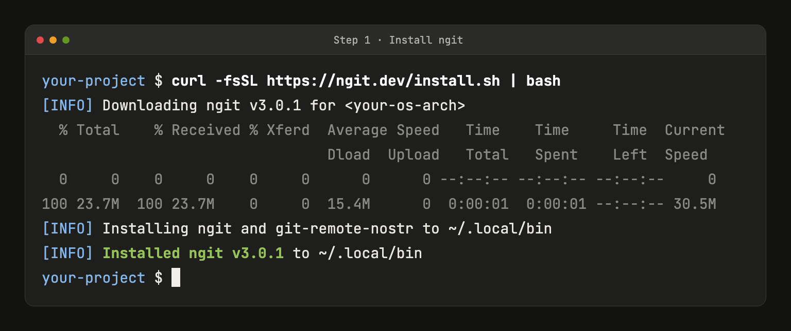
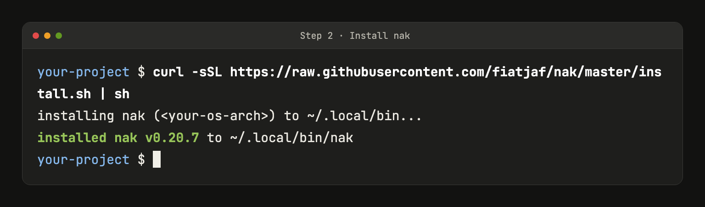
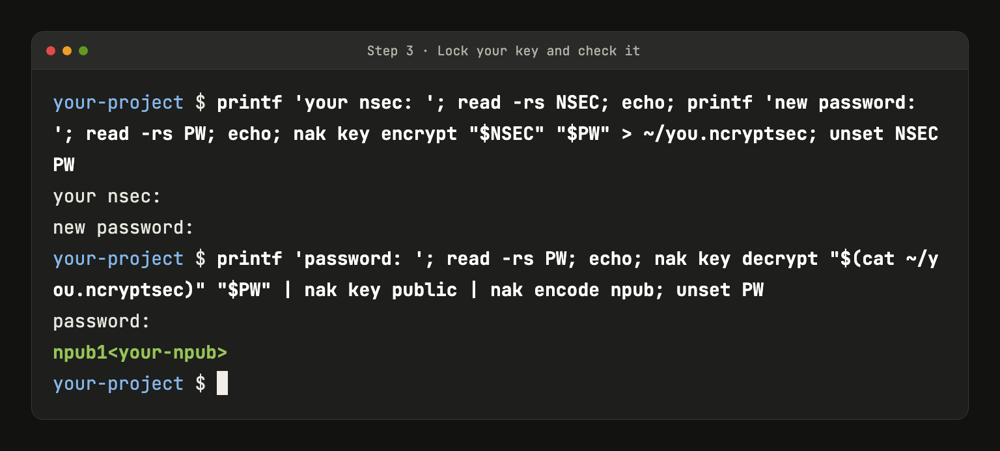
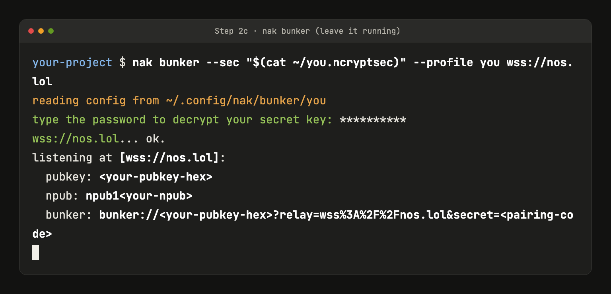
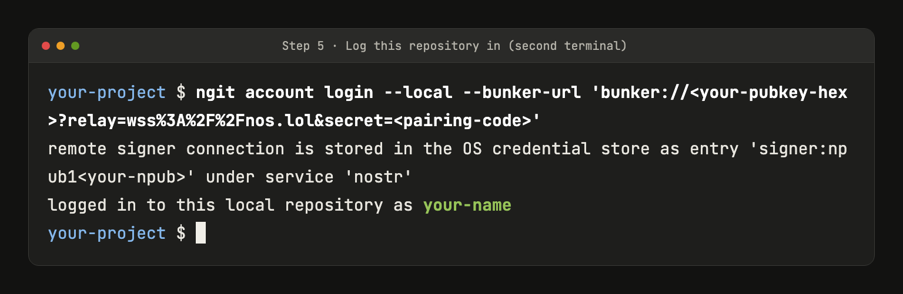
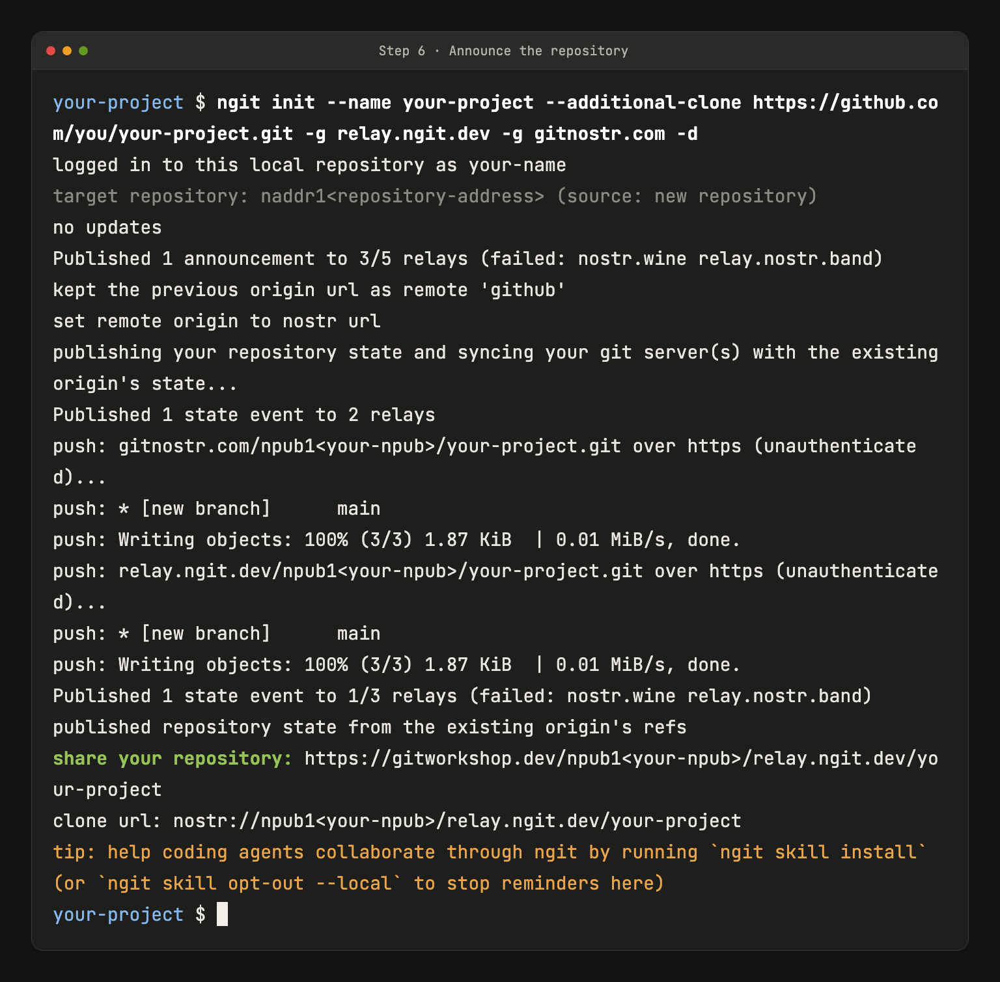
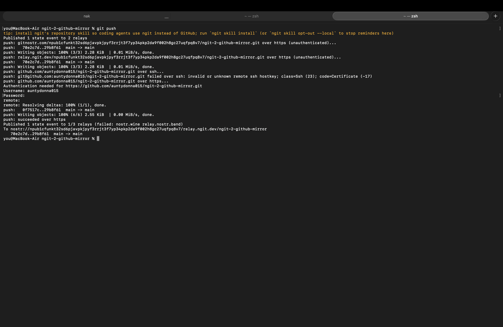

# ngit to GitHub Mirror Walkthrough

Quick cheat-sheet:

* [ngit](https://ngit.dev): the command-line tool that connects Git to nostr
* [Git Relays Authorized via Signed-Nostr Proofs (GRASP)](https://gitworkshop.dev/npub15qydau2hjma6ngxkl2cyar74wzyjshvl65za5k5rl69264ar2exs5cyejr/relay.ngit.dev/grasp): hosts the repositories
* [GitWorkshop.dev](https://gitworkshop.dev/): the first web client
* Git: stores the code, every version of it
* nostr: carries the signatures, issues, PRs, and comments

Now let's go.

## Tutorial

Ok, so first things first. Get git and curl on your terminal (on Windows, use WSL) and make sure you're inside the folder of the repository that you want to mirror (the mirror is public, even if the GitHub repository isn't).

No nostr account yet? Create your key at [nstart.me](https://nstart.me/en) first.

Before your first push, make a [personal access token](https://github.com/settings/personal-access-tokens/new) for just this repository (pick it under Repository access) with Contents set to Read and write, and keep it in your password manager. GitHub may ask for it again on later pushes, and the push fails if the `Password:` prompt sits there too long.

ngit and nak both install into `~/.local/bin`, so put that on your PATH first (on Linux or WSL, use `~/.bashrc` instead of `~/.zshrc`):

```
echo 'export PATH="$HOME/.local/bin:$PATH"' >> ~/.zshrc && source ~/.zshrc
```

**1. Install ngit.**

[The installer](https://ngit.dev/install.sh) will verify that it's downloaded properly, then once that's done, it will add `ngit` and `git-remote-nostr`, [which teaches Git to speak](https://ngit.dev/how-it-works) `nostr://` URLs:

```
curl -fsSL https://ngit.dev/install.sh | bash
```

You know it worked when you see: "Installed ngit v3.0.1".



**2. Get your nostr remote signer.**

First off, I don't know who needs to hear this but: never paste your nsec anywhere! Use [nak](https://opensats.org/projects/nak) here, as it's perfect for working on the terminal. Install it with its one-liner:

```
curl -sSL https://raw.githubusercontent.com/fiatjaf/nak/master/install.sh | sh
```



Then lock your key behind a password. This asks for your nsec and a new password without showing them or saving them in your shell history, and saves the result as `you.ncryptsec` in your home folder, outside your repository:

```
printf 'your nsec: '; read -rs NSEC; echo; printf 'new password: '; read -rs PW; echo; nak key encrypt "$NSEC" "$PW" > ~/you.ncryptsec; unset NSEC PW
```

Then check that the file really holds your key. It asks for the password again and prints your npub, make sure it's yours (if you get `failed to decrypt` instead, something got mistyped, just run the lock command again):

```
printf 'password: '; read -rs PW; echo; nak key decrypt "$(cat ~/you.ncryptsec)" "$PW" | nak key public | nak encode npub; unset PW
```



After that you can start a bunker, and just make sure that you leave it running, step 3, step 4 and every `git push` after that need it (next time, just run this same command again):

```
nak bunker --sec "$(cat ~/you.ncryptsec)" --profile you wss://nos.lol
```

It worked when nak asks for your password and then prints a `bunker://` address. Make sure to check that the printed npub is yours; if it isn't, stop, run `rm ~/.config/nak/bunker/you`, and redo the lock step.



**3. Sign this repository from a second terminal, again inside your project's folder.**

If you're paranoid, don't ever use `--nsec`, because otherwise your private key gets written into your shell history in plain text. That's the nice thing with nak's bunker: your key never leaves that first terminal and ngit only ever receives signatures.

Paste the full address in place of `bunker://...`, keeping the single quotes:

```
ngit account login --local --bunker-url 'bunker://...'
```

Don't share that address: until ngit uses it, anyone who has it can sign as you.

It worked when ngit answers: "logged in to this local repository as" followed by your name (or your npub).



If it just sits at `connecting to remote signer...`, press Ctrl+C in both terminals, start the bunker again and log in with the new address it prints (the code at the end changes every restart). If `ngit init` or a `git push` ever hangs, Ctrl+C it, restart the bunker and run it again, no new login needed.

**4. [Announce the repository](https://ngit.dev/repositories/mirroring)**

Keeping GitHub among its servers is what makes it a mirror. Swap in your GitHub URL, the `https://github.com/<user>/<repo>.git` address from GitHub's Code button, and your project's name, then run:

```
ngit init --name your-project --additional-clone https://github.com/you/your-project.git -g relay.ngit.dev -g gitnostr.com -d
```

`--additional-clone` is what keeps GitHub in the loop.

`-g` adds [free community servers](https://gitnostr.com).

`-d` accepts the defaults.

It worked when you see "share your repository:". A couple of relays failing along the way is normal. ngit pushes your code to the new servers right away and repoints `origin` at the nostr URL (your old GitHub remote is still there, now called `github`).



Now, whenever you commit, one ordinary `git push` feeds both GitHub and the nostr servers. If GitHub asks for a username and password (a `failed over ssh` line just before that is fine, it tries https next), use your GitHub username and that token, not your GitHub password. Careful with that token: copy it only when you're at the `Password:` prompt, and paste it right there. If the GitHub part still fails, `ngit sync` catches GitHub up.



---

Thank you for reading this far, please consider mirroring one of your repositories today and [donating to OpenSats](https://opensats.org/donate).

You can find Dan on nostr as [DanConwayDev](https://njump.me/npub15qydau2hjma6ngxkl2cyar74wzyjshvl65za5k5rl69264ar2exs5cyejr) and his repositories on [gitworkshop.dev](https://gitworkshop.dev/danconwaydev.com).
